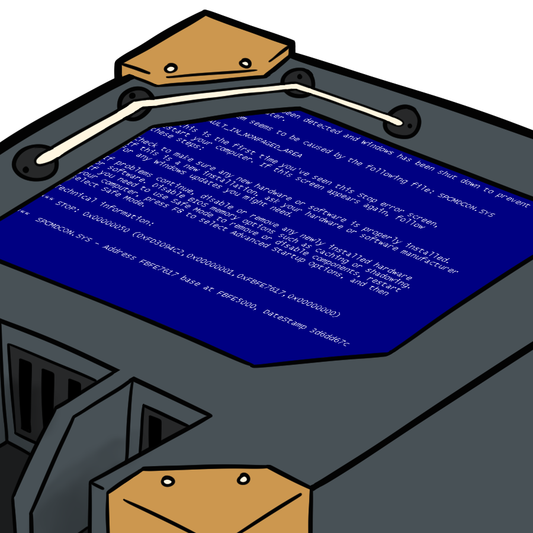

<h1 align="center">Welcome to the NodeBot project 👋</h1>

<h4 align="center">
  Project status:
  
  
</h4>

> What is NodeBot ?

NodeBot is a complete streamer bot I created because I needed something to automate some of the administration tasks in my stream and coded in golang because I wanted to learn this language. Therefore it is very cattered to my own needs as a streamer but hopefully it is configurable enough that you may be interested to host it for your own needs.

I'm streaming the development of this bot from scratch so if you're interested in coding & wanna learn feel free to drop me a follow ! You can find my socials in the [Support me](#support-me) section.

> Why "NodeBot" ?

Each member of my community is a node. In my VTuber lore, nodes are tiny robots that I created to automate my daily life & keep me company. Together they form a cluster and interact with each others using a specific protocol. Just like you would find those terms in distributed systems.

  

Here's a picture of a node.

*Although this once looks kinda dead I might need to help him*.

## Features

NodeBot acts as a moderator for your channel:

* Use your own bot account, the bot will appear in chat with the "bot" user badge
* Configure people you want to shoutout automatically

## Self-hosting

If you're looking to deploy that bot for yourself, you can check the [Self hosting documentation](docs/self_hosting.md).

## Roadmap

Feel free to check this [project's milestones](https://github.com/simplydreamy0/NodeBot/milestones) to see this project's roadmap and which are the next planned features !

## Contributing

I dont really take contributions since I'm developping this project I like to code the features myself, but if you have any interesting feature ideas feel free to create [A github issue](https://github.com/simplydreamy0/NodeBot/issues).

## Support me

Feel free to drop me a follow on my different platforms:

<h4 align="center">
  
  
  
</h4>
